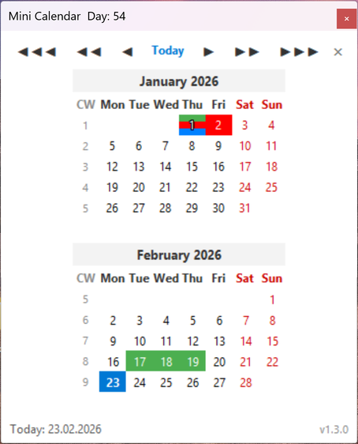
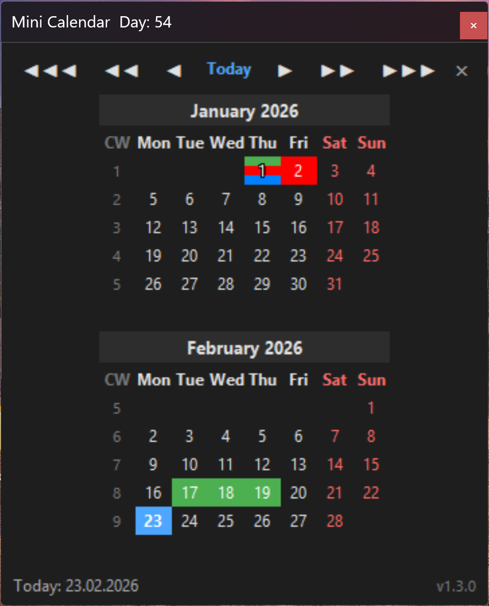

# Mini Calendar Tool

A lightweight Windows system-tray calendar with dark mode, ISO week numbers, holiday indicators, drag-to-select date ranges, and auto-fit multi-month view.

 

## Features

- **Dark / Light mode** — full theme toggle via Settings, persisted across sessions
- **System tray icon** displaying the current ISO week number
- **Multi-month view** — auto-fits months to window size when resizing
- **ISO week numbers** (CW) alongside each week row
- **Holidays** — selectable per country (Switzerland, Germany, China) with customizable colors and multi-color stripe indicators
- **Drag-to-select** date ranges with day/week count in the footer
- **Weekend highlighting** (Sat/Sun in red / dark-mode adjusted)
- **Navigation** — `◀`/`▶` month, `◀◀`/`▶▶` page, `◀◀◀`/`▶▶▶` year
- **Start with Windows** option via registry autostart
- **Keyboard:** Escape clears selection, second Escape hides the window

## Installation

### Standalone (no Python required)

Download `MiniCalendar.exe` from [Releases](https://github.com/si3rc0-sw/mini-calendar-tool/releases) and run it.

### From source

```bash
pip install pystray Pillow
python main.py
```

Use `pythonw main.py` to run without a console window.

## Build standalone .exe

```bash
pip install pyinstaller
pyinstaller --onefile --noconsole --name MiniCalendar main.py
```

The output will be in `dist/MiniCalendar.exe`.

## Usage

- **Left-click** the tray icon to toggle the calendar
- **Right-click** the tray icon for Settings / Exit
- **Navigate** months with `◀`/`▶`, pages with `◀◀`/`▶▶`, years with `◀◀◀`/`▶▶▶`
- **Drag** across days to select a date range and see the duration
- **Resize** the window to show more months in a grid layout

## Settings

| Option | Description |
|---|---|
| Dark mode | Switch between dark and light theme |
| Start with Windows | Launch automatically on Windows login |
| Holidays | Enable/disable holidays per country with color picker |

## Requirements

- Windows 10/11
- Python 3.10+ (when running from source)

## License

[MIT + Commons Clause](LICENSE) — free to use, modify, and share; commercial sale is not permitted.
